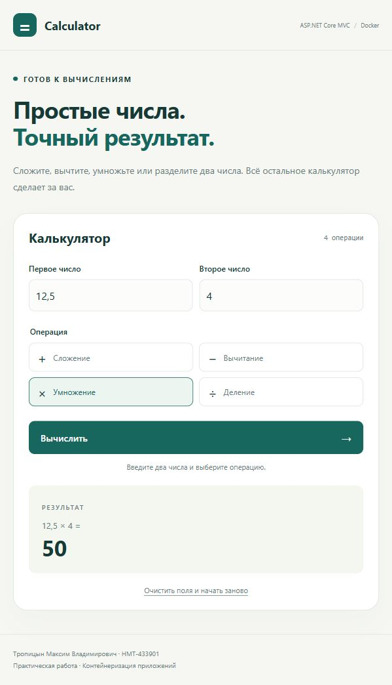
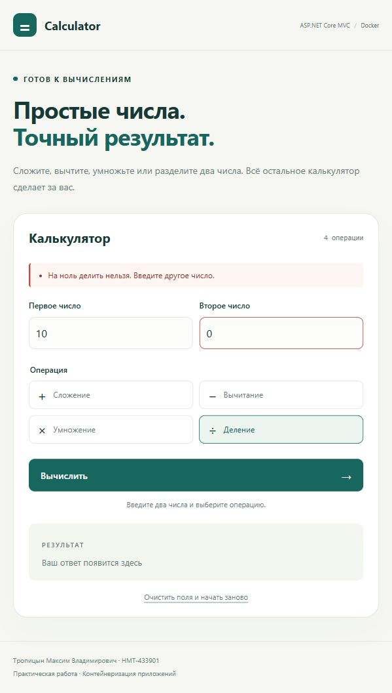

Уральский федеральный университет
имени первого Президента России Б. Н. Ельцина

Отчет по практической работе
Контейнеризация приложения
Калькулятор с использованием Docker

ASP.NET Core MVC
Задание 1.7.1

Выполнил Тропицын Максим Владимирович
Группа НМТ-433901
Номер в журнале 16
Преподаватель Лавров В. В.

Екатеринбург 2026
Дата подготовки 6 октября 2026 года

## 1 Цель работы и состояние выполнения

Цель работы - разработать веб-калькулятор на ASP.NET Core MVC, подготовить Dockerfile, разместить исходный код на GitHub и проверить сборку, запуск, остановку и повторный запуск контейнера.

Приложение прошло локальную сборку и проверку вычислений и HTTP-формы. На рабочем компьютере установлены WSL 3.0.1 и Docker Desktop 4.94.0. Образ 16-calculator:latest собран, контейнер calculator-16 запущен на порту 5016. Проверены HTTP-форма, остановка, недоступность после остановки и повторный запуск. Публикация исходного кода на GitHub выполняется студентом самостоятельно.

| Этап | Результат на дату подготовки |
| --- | --- |

| Приложение MVC | Разработано и проверено локально |

| Dockerfile | Создан; образ успешно собран |

| GitHub | Подготовлены команды; публикация ожидает выполнения |

| Docker build и docker run | Выполнены и проверены |

| Docker stop и docker start | Выполнены; недоступность и восстановление проверены |

| Отчет | Требуются скриншоты GitHub, клонирования и окна Visual Studio |

## 2 Разработка приложения

Создано решение CalculatorDocker.sln с MVC-проектом CalculatorWeb и проектом проверок CalculatorWeb.Checks. Целевая платформа - .NET 8, как в примере учебного пособия. Разработка выполнена в исходных файлах; решение можно открыть в Visual Studio.

Модель CalculatorViewModel хранит два операнда и выбранную операцию. Контроллер CalculatorController обрабатывает GET-запрос страницы и POST-запрос формы. CalculatorService разбирает ввод и выполняет арифметические операции. Razor-представление показывает результат или сообщение об ошибке.

Числа обрабатываются как decimal. Дробный разделитель может быть точкой или запятой. Проверяются обязательность ввода, корректность числа, допустимость операции, деление на ноль и переполнение. На странице отображаются ФИО и группа студента. POST-форма использует защитный токен ASP.NET Core.

Номер студента в журнале - 16. Индивидуальный порт рассчитан по правилу 5000 + 16 = 5016. В appsettings.json адрес Kestrel задан как http://0.0.0.0:5016. В браузере используется http://localhost:5016.

```
dotnet build CalculatorDocker.sln -c Release
dotnet run --project CalculatorWeb
dotnet run --project CalculatorWeb.Checks -c Release
./scripts/Test-Web.ps1 -BaseUrl http://localhost:5016
```

Сборка завершилась без ошибок и предупреждений. Пройдено 23 проверки арифметики и контроллера, а также 13 проверок HTTP-интерфейса. Команда dotnet publish с параметром UseAppHost=false успешно создала опубликованную DLL и необходимые файлы. Текстовые журналы сохранены в docs/evidence.

| Проверка | Ввод | Результат |
| --- | --- | --- |

| Сложение | 12 + 4 | 16 |

| Вычитание | 12 - 4 | 8 |

| Умножение | -3 × 4 | -12 |

| Деление | 7 ÷ 2 | 3,5 |

| Дробные числа | 0,1 + 0.2 | 0,3 |

| Деление на ноль | 10 ÷ 0 | Сообщение об ошибке |

| Некорректный ввод | abc и 2 | Сообщение об ошибке |

| POST без токена | Запрос без CSRF-токена | HTTP 400 |

## 3 Проверка веб интерфейса

Приложение в контейнере calculator-16 открыто в браузере на порту 5016. Введены числа 12,5 и 4, выбрано умножение и нажата кнопка вычисления. Получен результат 50.



## 4 Проверка обработки ошибки

При делении 10 на 0 приложение показывает сообщение «На ноль делить нельзя. Введите другое число». Ошибочный результат не выводится, введенные значения сохраняются для исправления.



## 5 Создание Dockerfile

В корневой папке решения создан Dockerfile с двумя этапами. На этапе build используется SDK .NET 8, восстанавливается проект и выполняется публикация. На окончательном этапе используется ASP.NET Core Runtime 8. В образ копируются опубликованные файлы, задается окружение Production, порт 5016 и запуск DLL. Приложение запускается от непривилегированного пользователя APP_UID.

Файл .dockerignore исключает bin, obj, служебные папки Git, отчеты и временные материалы из контекста сборки. Параметр APP_PORT позволяет изменить порт при сборке образа. Значение для этой работы по умолчанию - 5016.

```
# Build the application with the SDK.
FROM mcr.microsoft.com/dotnet/sdk:8.0 AS build
WORKDIR /src
COPY CalculatorWeb/CalculatorWeb.csproj CalculatorWeb/
RUN dotnet restore CalculatorWeb/CalculatorWeb.csproj
COPY CalculatorWeb/ CalculatorWeb/
RUN dotnet publish CalculatorWeb/CalculatorWeb.csproj -c Release -o /app/publish --no-restore /p:UseAppHost=false

# The final image only needs the ASP.NET Core runtime.
FROM mcr.microsoft.com/dotnet/aspnet:8.0 AS final
WORKDIR /app
ARG APP_PORT=5016
ENV ASPNETCORE_HTTP_PORTS=${APP_PORT}
ENV Kestrel__Endpoints__Http__Url=http://0.0.0.0:${APP_PORT}
ENV ASPNETCORE_ENVIRONMENT=Production
EXPOSE ${APP_PORT}
COPY --from=build /app/publish .
USER $APP_UID
ENTRYPOINT ["dotnet", "CalculatorWeb.dll"]
```

## 6 Размещение исходного кода на GitHub

Для публикации требуется создать пустой личный репозиторий на GitHub и выполнить команды ниже. В URL нужно заменить YOUR_GITHUB_LOGIN своим логином, а при другом имени репозитория - также имя docker-calculator. Публикация на дату подготовки отчета еще не выполнена.

```
git add .
git commit -m "Add ASP.NET Core MVC calculator and Dockerfile"
git branch -M main
git remote add origin https://github.com/YOUR_GITHUB_LOGIN/docker-calculator.git
git push -u origin main
```

После публикации необходимо указать фактическую ссылку на репозиторий и вставить скриншот страницы GitHub. Для демонстрации клонирования на сервере или другом компьютере используются следующие команды.

```
git clone https://github.com/YOUR_GITHUB_LOGIN/docker-calculator.git
cd docker-calculator
```

## 7 Сборка и запуск Docker контейнера

Для этого этапа необходимо установить и запустить Docker Desktop с поддержкой Linux containers либо использовать сервер с Docker Engine. Команда docker version должна показывать сведения о Client и Server. Перед контейнерным запуском следует остановить локальный процесс dotnet run, чтобы освободить порт 5016.

```
docker version
docker build -t 16-calculator:latest .
docker images -a
docker run -d -p 5016:5016 --name calculator-16 16-calculator:latest
docker ps
docker logs calculator-16
```

Имя образа начинается с номера студента в журнале. Параметр -d задает фоновый запуск, -p публикует порт 5016 хоста и связывает его с портом 5016 контейнера. После запуска нужно открыть http://localhost:5016 или адрес удаленного сервера с этим портом.

Образ успешно собран из Dockerfile. Контейнер запущен и обслуживает страницу калькулятора и endpoint /health на порту 5016. Все 13 HTTP-проверок пройдены внутри контейнера. Журналы сборки, версии Docker, списка образов и контейнеров сохранены в docs/evidence.

Идентификатор собранного образа:

```
sha256:03112ea284e3ccb418002b291f0d186ab85ffb27ca34ec27ae9d8cb3852c321f
```

Пользователь контейнера 1654. Окружение Production. Опубликованный порт 5016.

## 8 Остановка и повторный запуск

```
docker stop calculator-16
docker ps -a
docker inspect --format '{{.State.Status}}' calculator-16
docker start calculator-16
docker ps
docker stop calculator-16
```

После docker stop ожидается состояние exited. При обновлении страницы приложение должно быть недоступно. После docker start тот же контейнер должен снова обслуживать запросы. Остановка сохраняет контейнер и его имя для повторного запуска.

При фактической проверке после остановки получено состояние exited, HTTP-запрос не установил соединение. После docker start endpoint /health снова вернул OK. По завершении проверки контейнер оставлен остановленным. Результаты зафиксированы в docker-lifecycle.txt и docker-verification.json.

| Проверка | Фактический результат |
| --- | --- |

| Контейнер | ee52946f7e6d / calculator-16 |

| Публикация порта | 0.0.0.0:5016 -> 5016/tcp |

| HTTP-проверки | 13 из 13 пройдены |

| После docker stop | exited; запрос к /health не установил соединение |

| После docker start | /health вернул 200 OK |

| Завершение демонстрации | Контейнер остановлен; код завершения 0 |

В scripts/Demo-Docker.ps1 подготовлен сценарий, который собирает образ, запускает контейнер, выполняет 13 HTTP-проверок, останавливает приложение, проверяет его недоступность, повторно запускает и снова останавливает контейнер. Существующие контейнеры не удаляются.

```
./scripts/Demo-Docker.ps1 -StudentNumber 16
```

## 9 Материалы для завершения отчета

Перед сдачей необходимо добавить фактическую ссылку на GitHub и скриншоты окна Visual Studio с appsettings.json, опубликованного репозитория и результата git clone. Для соответствия перечню методички также добавьте снимки терминала со сборкой образа и работающим контейнером по сохраненным журналам реальных команд.

Форма отчета из вложения не была предоставлена; использована обычная структура практической работы с титульным листом, этапами, результатами и листингами.

Скриншоты в разделах 3 и 4 подтверждают работу приложения из Docker-контейнера. Текстовые свидетельства сборки, состояния контейнера, остановки и повторного запуска находятся в docs/evidence.

## 10 Вывод

Разработан веб-калькулятор ASP.NET Core MVC и подготовлен Dockerfile. Образ собран, контейнер запущен на порту 5016; проверены вычисления, ошибки ввода, остановка и повторный запуск. Для завершения сдаваемого отчета остается опубликовать исходный код на GitHub, добавить ссылку, скриншоты репозитория, клонирования и требуемые снимки окон Visual Studio и терминала.

## Источники

Лавров В. В., Гурин И. А. Основы методологии Development Operation. Практикум. Екатеринбург, 2025. 140 с. Пункт 1.7.1, с. 31-35. https://elar.urfu.ru/handle/10995/145068

Microsoft Learn. Run an ASP.NET Core app in Docker containers. https://learn.microsoft.com/aspnet/core/host-and-deploy/docker/building-net-docker-images

Docker Docs. Install Docker Desktop on Windows. https://docs.docker.com/desktop/setup/install/windows-install/

## Приложение А Контроллер

CalculatorWeb/Controllers/CalculatorController.cs

```
using CalculatorWeb.Models;
using CalculatorWeb.Services;
using Microsoft.AspNetCore.Mvc;

namespace CalculatorWeb.Controllers;

public sealed class CalculatorController(CalculatorService calculator) : Controller
{
    [HttpGet]
    public IActionResult Index() => View(new CalculatorViewModel());

    [HttpPost]
    [ValidateAntiForgeryToken]
    public IActionResult Index(CalculatorViewModel model)
    {
        var firstValid = CalculatorService.TryParseNumber(model.FirstNumber, out var first);
        var secondValid = CalculatorService.TryParseNumber(model.SecondNumber, out var second);

        if (!string.IsNullOrWhiteSpace(model.FirstNumber) && !firstValid)
            ModelState.AddModelError(nameof(model.FirstNumber), "Введите корректное число, например 12,5 или -3.");
        if (!string.IsNullOrWhiteSpace(model.SecondNumber) && !secondValid)
            ModelState.AddModelError(nameof(model.SecondNumber), "Введите корректное число, например 12,5 или -3.");
        if (!CalculatorService.IsOperationSupported(model.Operation))
            ModelState.AddModelError(nameof(model.Operation), "Выберите одну из четырёх операций.");

        if (!ModelState.IsValid)
            return View(model);

        try
        {
            model.Result = CalculatorService.Format(calculator.Calculate(first, second, model.Operation));
            model.Expression = $"{CalculatorService.Format(first)} {CalculatorService.Symbol(model.Operation)} {CalculatorService.Format(second)}";
        }
        catch (DivideByZeroException)
        {
            ModelState.AddModelError(nameof(model.SecondNumber), "На ноль делить нельзя. Введите другое число.");
        }
        catch (OverflowException)
        {
            ModelState.AddModelError("", "Результат выходит за допустимый диапазон decimal. Используйте меньшие числа.");
        }

        return View(model);
    }

    [ResponseCache(Duration = 0, Location = ResponseCacheLocation.None, NoStore = true)]
    public IActionResult Error() => View();
}
```

## Приложение Б Настройки приложения

CalculatorWeb/appsettings.json

```
{
  "Kestrel": {
    "Endpoints": {
      "Http": {
        "Url": "http://0.0.0.0:5016"
      }
    }
  },
  "Logging": {
    "LogLevel": {
      "Default": "Information",
      "Microsoft.AspNetCore": "Warning"
    }
  },
  "AllowedHosts": "*"
}
```

## Приложение В Настройки среды разработки

CalculatorWeb/appsettings.Development.json

```
{
  "Logging": {
    "LogLevel": { "Default": "Information", "Microsoft.AspNetCore": "Information" }
  }
}
```

## Приложение Г Точка входа

CalculatorWeb/Program.cs

```
using CalculatorWeb.Services;

var builder = WebApplication.CreateBuilder(args);
builder.Services.AddControllersWithViews();
builder.Services.AddSingleton<CalculatorService>();

var app = builder.Build();
if (!app.Environment.IsDevelopment())
{
    app.UseExceptionHandler("/Calculator/Error");
}

app.UseStaticFiles();
app.UseRouting();
app.MapGet("/health", () => Results.Text("OK"));
app.MapControllerRoute("default", "{controller=Calculator}/{action=Index}/{id?}");
app.Run();
```
